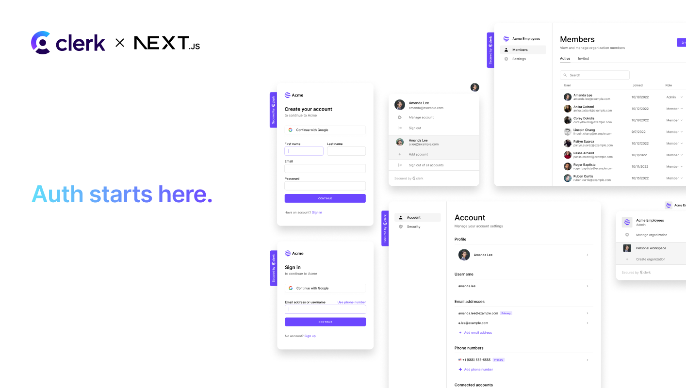

# Next.js Clerk Template



This template shows how to use [Clerk](https://www.clerk.com/?utm_source=github&utm_medium=template_repos&utm_campaign=nextjs_template) in a Next.js application.

Clerk is a developer-first authentication and user management solution. It provides pre-built React components and hooks for login, signup, user profile, and organization management. Clerk is designed to be easy to use and customize, and can be dropped into any React or Next.js application.

This template allows you to get started with Clerk and Next.js in a matter of minutes, and includes:

- Fully functional auth flow with login, signup, and a protected page
- Customized Clerk components with Tailwind CSS
- Hooks for accessing user data and authentication state
- Organizations for multi-tenant applications

[](https://discord.com/invite/b5rXHjAg7A)
[](https://docs.clerk.com)
[](https://twitter.com/intent/follow?screen_name=ClerkDev)

## Demo

A hosted demo of this example is available at [clerk-nextjs-template.vercel.app](https://clerk-nextjs-template.vercel.app/)

## Deploy

Easily deploy the template to Vercel with the button below. You will need to set the required environment variables in the Vercel dashboard.

[](https://vercel.com/new/clone?repository-url=https%3A%2F%2Fgithub.com%2Fclerkinc%2Fclerk-next-app&env=NEXT_PUBLIC_CLERK_PUBLISHABLE_KEY,CLERK_SECRET_KEY&envDescription=Clerk%20API%20keys&envLink=https%3A%2F%2Fclerk.com%2Fdocs%2Fnextjs%2Fget-started-with-nextjs%23set-environment-keys&redirect-url=https%3A%2F%2Fclerk.com%2Fdocs%2Fnextjs%2Fget-started-with-nextjs)

## Running the template

```bash
git clone https://github.com/clerkinc/clerk-next-app
```

To run the example locally you need to:

1. [Sign up for a Clerk account](https://dashboard.clerk.com/sign-up?utm_source=github&utm_medium=template_repos&utm_campaign=nextjs_template) at https://clerk.com.
2. Go to [Clerk's dashboard](https://dashboard.clerk.com?utm_source=github&utm_medium=template_repos&utm_campaign=nextjs_template) and create an application.
3. Set the required Clerk environment variables as shown in [the example env file](./.env.example).
4. `npm install` the required dependencies.
5. `npm run dev` to launch the development server.

## Learn more

To learn more about Clerk and Next.js, check out the following resources:

- [Quickstart: Get started with Next.js and Clerk](https://clerk.com/docs/quickstarts/get-started-with-nextjs?utm_source=github&utm_medium=template_repos&utm_campaign=nextjs_template)
- [Clerk Documentation](https://clerk.com/docs?utm_source=github&utm_medium=template_repos&utm_campaign=nextjs_template)
- [Next.js Documentation](https://nextjs.org/docs)

## Contact

If you need support or have anything you would like to ask, please reach out in our [Discord channel](https://discord.com/invite/b5rXHjAg7A). We'd love to chat!
